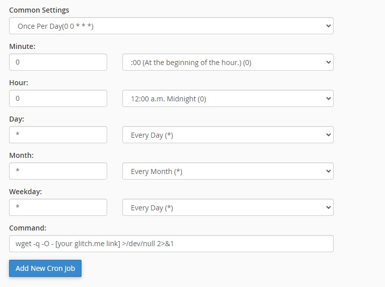

#✨ WaktuSolatSACTwitterBot
-------------------

[WaktuSolatSACTwitterBot] is a bot that will tweet your shah alam prayer time everyday at 12 am on Glitch.me using Flask 🌶️
-------------------
I have a hard time deploying this using CPanel, therefore Glitch or Heroku is my second option.

Output Sample

How to run on Glitch?
-------------------
- Create your glitch account `http://glitch.com/`
- git clone `https://github.com/deadrepo/WaktuSolatSACTwitterBot.git` or create a new project and import from github
- pip install urllib3==1.26.6
- pip3 install -r `requirements.txt` [need to be installed seperately as urllib3 can only be installed with pip]
- python3 `app.py`
- `start.sh` will run your bot automatically actually, no need to do the previous steps

API Endpoints
-------------------
- Data from [JAKIM's E-Solat](http://www.e-solat.gov.my)
- [Shah Alam](https://www.e-solat.gov.my/index.php?r=esolatApi/takwimsolat&period=today&zone=sgr01)
- [KL](https://www.e-solat.gov.my/index.php?r=esolatApi/takwimsolat&period=today&zone=wly01)

How to use Cron Job ?
-------------------
- You can use any cron job available online 

Improvement to be made
-------------------
- 12 hours version

Made by [deadrepo]
-------------------

(づ ◕‿◕ )づ
